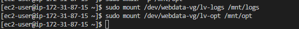
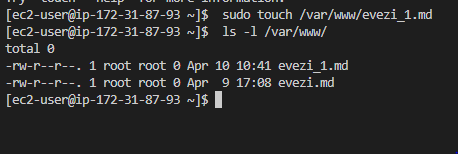
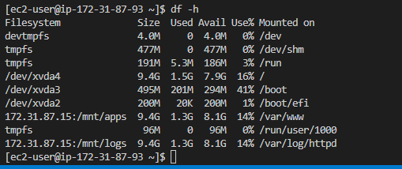

## Documentation for Project 7
## IMPLEMENT A CLIENT SERVER ARCHITECTURE USING MYSQL DATABASE MANAGEMENT SYSTEM (DBMS)

## STEP 1 — CLIENT SERVER ARCHITECTURE WITH MYSQL

-- Starting by spinning up Four RHEL 8 EC2 instance (3 - Web Server and 1 - NFS Web Server) labelled "P-7 Web Server-1, 2 and 3 and P-7 NFS. Also an Ubuntu 20.04 Linux server for MySQL Database Server" Labelled "P-7 DB Server - MySQL Client" from my local windows terminal.

`lsblk`--(Checking inital disk present by running command in NFS Server instance, display shows a default disk 'xvda' and 4 partitions 'xvda1 to xvda4' currently present)

`lsblk`--(Creating addtional three volumes in my Ec2 instaance and attaching volumes to my NFS Server. Now running 'lsblk' command again, we want to inspect what block devise is attached to server (default disk of NFS Server) 'xvdf, xvdg and xvdh')

`ls /dev`--(Running command to view all folders and devices in directory of root device been listed)

`sudo gdisk /dev/xvdf`;`sudo gdisk /dev/xvdg`;`sudo gdisk /dev/xvdh`--(using the gdisk utility to Create single partition on each of the disk within directory of root device)

`lsblk`--(using command to display shows disk 'xvdf' and 1 partition created 'xvdf1' currently present within directory of root device)

`sudo yum install -y lvm2`--(Install lvm2 pakage using redhat package manager)

`which lvm`--(To check location of LVM package Installed)

`lvmdiskscan`--(To check for available partitions)

`sudo pvcreate /dev/xvdf1 /dev/xvdg1 /dev/xvdh1`--(using the pvcreate utility to mark each of the 3 disks as physical volume to be used by logical volume management)

`sudo pvs`--(Running command to confirm each of the disk partitioned are marked to be used for LVM. Each of these are individual disk are now physical volume.

`sudo vgcreate webdata-vg /dev/xvdf1 /dev/xvdg1 /dve/xvdh1`--(Using the vgcreate utility command to add all 3 physical volumes to a volume group. What this does is concantinate all 3 pv as one individual one.

`sudo vgs`--(Running command to confirm the physical volumes are in the newly created volume group.

`sudo lvcreate -n lv-apps -L 9G webdata-vg`; `sudo lvcreate -n lv-logs -L 9G webdata-vg`; 
`sudo lvcreate -n lv-opt -L 9G webdata-vg`;`sudo lvs`--(Using the lvcreate utility command to create 3 logical volumes 'lv-apps', 'lv-logs' and 'lv-opt' allocating the PV space in the webdata-vg in three equal half. Run sudo lvs to confirm lv action was successful)

`lsblk`--(Final setup display; 3 physical volume in webdata-vg volume group then created 3 logical volume 'lv-logs', 'lv-apps' and 'lv-opt' with equal size space.

`sudo mkfs.xfs /dev/webdata-vg/lv-apps`; `sudo mkfs.xfs /dev/webdata-vg/lv-logs`;`sudo mkfs.xfs /dev/webdata-vg/lv-opt`;--(We have created 3 devices within directory '/dev/webdata-vg/lv-apps', '/dev/webdata-vg/lv-logs' and '/dev/webdata-vg/lv-opt' for logical volume 'lv-apps', 'lv-logs' and 'lv-opt' added to filesystem).

`sudo mkdir -p /mnt/apps`--(Creating 'apps' folder within the  default 'mnt' directory of linux os. [NFS-CreateDir-MntApps](./Image-7/NFS-CreateDir-MntApps-17.PNG)

`sudo mkdir -p /mnt/logs`;`sudo mkdir -p /mnt/opt`--(Creating 'logs' and 'Opt' folder within the default 'mnt' directory of linux os. 
[NFS-CreateDir-MntLogs-MntOpt](./Image-7/NFS-CreateDir-MntLogs-MntOpt-18.PNG)

`sudo mount /dev/webdata-vg/lv-apps /mnt/apps`;`sudo mount /dev/webdata-vg/lv-logs /mnt/logs`;
`sudo mount /dev/webdata-vg/lv-opt /mnt/opt`--(Mounting points on mount directories '/mnt/apps`,'/mnt/logs' and /mnt/opt')

`df -h`--(Confirming the temporary mount of the block device on each of the /mnt direcrory)

## Step - 4 Install NFS Server

`sudo yum update -y`; `sudo yum install -y nfs-utils`--(Running command to update the RHEL 8 with Redhat Package manager. 2. Using Redhat package manager to install NFS- Utils)

`sudo systemctl status nfs-server.service` --(Using command to check NFS server status that is up and running and we started and enabled NFS server)

`sudo chown -R nobody: /mnt/apps`;`sudo chmod -R 777  /mnt/apps` --(1.Change ownership to nobody owns the file or directory. 2. Assign permissions to allow our Web Servers to read, write and execute files on NFS)

`sudo vi /etc/exports`;` sudo exportfs -arv` --(Configure access to NFS for clients within the same subnet (example of Subnet CIDR. Run command to edit /etc/exports configuration file using subnet CIDR from my Web Server instance -1. 2. - The 'exportfs' command allows the edited /etc/exports config file to be exported from the vi text editor)

`rpcinfo -p | grep nfs` --(Check which port is used by NFS.NFS server to be accessible from your client, you must also open following ports: TCP 111, UDP 111, UDP 2049 and TCP 2049)

## STEP 2 — CONFIGURE THE DATABASE SERVER

`sudo apt update`--(Running command  in both instance MYSQL Server and MySQL Client  ubuntu server to update my list of packages in Ubuntu package manager)

`sudo apt install -y mysql-server`--(Install MYSQL Server software to my Mysql server linux instance)

`sudo mysql`;`create database tooling;`; `create user 'webaccess'@'172.31.80.0/20' identified by "Friendly1";`--(Firstly created a database called 'tooling'. Create username and password for my mysql  'Tooling'database)

`grant all on tooling.* to 'webaccess'@'172.31.80.0/20' with grant option;`--(Grant all privileges on mysql server to 'webaccess' user)

`Show database;`--(Successfully connected to a remote MySQL server and can perform SQL queries. Display table in mysql server database from mysql client Linux Server)

`flush privileges;`--(Update all changes to database)

`select user from mysql.user;`--(this command is to list the names of users in the databases)

## Step 3 - Prepare the Web Servers

`sudo yum update -y`; `sudo yum install -y nfs-utils nfs4-acl-tools`--(Running command to update the RHEL 9 with Redhat Package manager. 2. Using Redhat package manager to install NFS- Utils client)

`sudo mkdir -p /var/www`; `sudo mount -t nfs -o rw,nosuid 172.31.87.15:/mnt/apps /var/www`; `df-h`--(Running command 1. make folder 'wwww' within the var directory. 2.using private ip address of NFS server, this is to Mount /var/www/ and target the NFS server’s export for apps. 3.Verify that NFS was mounted successfully)

`sudo vi /etc/fstab`--(Using vi text editor to update /etc/fstab configuration file in this format)

`df -h` --(Run command to verify that NFS was mounted successfully)

`sudo touch /var/wwww/evezi.md`; `sudo touch /var/wwww/evezi_1.md` --(On the web server-1 terminal, Create a evezi.md and evezi_1.md files within wwww folder of the var root directory)

`sudo ls -l /mnt/apps/` --(On the NFS server terminal, run command in the 'apps' folder out of root 'mnt' directory to verify both evezi.md and evezi_1.md files exist. This is to confirm that web server-1 acting as a client can remotely login to NFS to read, write and execute files on NFS server)

## To install Apache, PHP and it’s depemdencies

`sudo yum install -y httpd` --(using RHEL package manager to install apache server to serve content to end user)

`sudo subscription-manager repos --enable codeready-builder-for-rhel-9-$(arch)-rpms` --(Consilidation of RHEL system, RHEL8 to RHEL9. Enable codeready builder repository for our RHEL system by utilizing subscription-manager)

`sudo dnf install https://dl.fedoraproject.org/pub/epel/epel-release-latest-9.noarch.rpm -y` --(Install Epel rhel-9 repository. To install latest version of PHP as prior knowlegde Wordpress would only work with latest configuration of PHP especially Redhat enterprise Linux)

`sudo dnf install http://rpms.remirepo.net/enterprise/remi-release-9.rpm -y` --(Install Remi rhel-9 repository)

`sudo dnf module list php` --(List PHP modules we may wish to install)

`sudo dnf module reset php` --(Reset PHP modules and confirming PHP version installed)

`sudo dnf module reset php:remi-7'4` --(Enable remi-7.4 PHP module)

`sudo yum install php php-opcache php-gd php-curl php-mysqlnd` --(Install PHP, PHP-pfm 'fastcgi' and associate PHP modules)

`sudo systemctl start php-fpm` --(This command is to start the system, after which we enable the php fastcgi. Also confirming php-fpm is active and running by checking system status)

`sudo setsebool -p httpd_execmem 1` --(This command is to redhat policies on directories and files)(Input public IP Address in the web browser to display Redhat test page)

`sudo mount -t nfs -o rw,nosuid 172.31.87.15:/mnt/logs /var/log/httpd`;`df -h` --(Using private ip address of NFS server, this is to Mount '/mnt/logs' that targets the NFS server’s export for logs out of directory '/var/log/html'. 3.Verify that NFS was mounted successfully)

`sudo vi /etc/fstab`--(Using vi text editor to update /etc/fstab configuration file, making it persistent mount of NFS on '/mnt/logs' on '/var/log/html')

`ls html/. `; `ls /var/www/html` --(To confirm same HTML files exist within both clone'/tooling/html' folder and within '/var/www/html'directory. Copied over succussfully)

`http://184.73.65.229`--(Including port TCP:80 to web server-1 aws ec2 security group and inserting public IP address to web browser displays Redhat test page)

`sudo cp /etc/httpd/conf.d/welcome.conf /etc/httpd/conf.d/welcome.conf_backup`--(To disabled Redhat test/ welcome page)

`sudo setenforce 0`;`sudo vi /etc/sysconfig/selinux`--(Running command - 1. To disable SELinux  2. - To make this change permanent – using vi text editor to amend config file to set 'SELINUX=disabled')

`sudo vi /var/www/html/functions.php`--(Update the website’s configuration to connect to the mysql database server in '/var/www/html/functions.php' file)

`sudo vi /etc/mysql/mysql.conf.d/mysqld.cnf`--(To set bind address in mysql database server for 'mysql' and 'mysqlx' configuration file to be accessed from all IP addresses)

`sudo vi /etc/mysql/mysql.conf.d/mysqld.cnf`--(Running command to apply tooling-db.sql script to my database)

`show databases;` ; `use tooling;` --(Running command to display all databases and utilize tooling database)

`show tables;` ; `select * from users;`;
`INSERT INTO `users` (`id`, `username`, `password`, `email`, `user_type`, `status` VALUES (2, 'myuser', '5f4dcc3b5aa765d61d8327deb882cf99', 'user@mail.com', 'admin', 1);)` ; `select * from users;`
--(Create in MySQL a new admin user with username: myuser and password: password)

`curl localhost`--(To confirm reading from my localhost. 2.- go over to Md5 decrypt website to decrypt the alphanumeric code to get the actual password to login with in the website)

(./Image-7/Webserver-1-Hash-Password-29.PNG)

`<my-server-Public-Ad>`--(Opening website in my browser by inserting web server-1 public IP address in browser to display our website. 2. - Confirm login into the website with 'myuser' user)(Completed the implementation of a web solution for a DevOps team using LAMP stack with remote Database and NFS servers)

